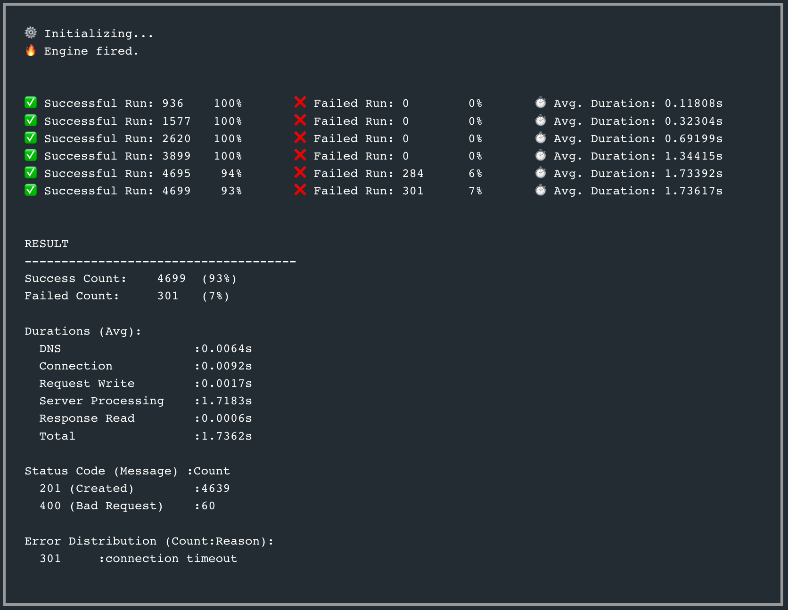

# Bk Rest App

### Company REST Microservice

****
[](https://goreportcard.com/report/github.com/by-sabbir/company-microservice-rest)

## Install the Dependencies

```bash
go mod tidy
```

## Serve API Service

```bash
make up
```

## Run Unit Test

```bash
make test
```
coverage: **73.6%** of statements


## Endpoints/API Doc With Postman

[](https://app.getpostman.com/run-collection/19090428-0bb86900-8dd7-4930-83d2-fcc563501c4c?action=collection%2Ffork&collection-url=entityId%3D19090428-0bb86900-8dd7-4930-83d2-fcc563501c4c%26entityType%3Dcollection%26workspaceId%3D755b284e-1801-4e9a-a4d8-36fb74cc2021)

**Additionally**, to view the application log and cleanup run the following:

```bash
make logs
```

and

```bash
make cleanup
```

### Load Test Result
(initial load test with Ddosify)


The service can serve **2.5K+ write request/sec** with authentication on commodity hardware.

### Features

- Production-grade multi-stage build container only 14MB size.
- JWT Authentication (jwt.io, secret = bk-go-dev)
- Well tested with unittests
- Integration tests embedded
- Graceful shutdown
